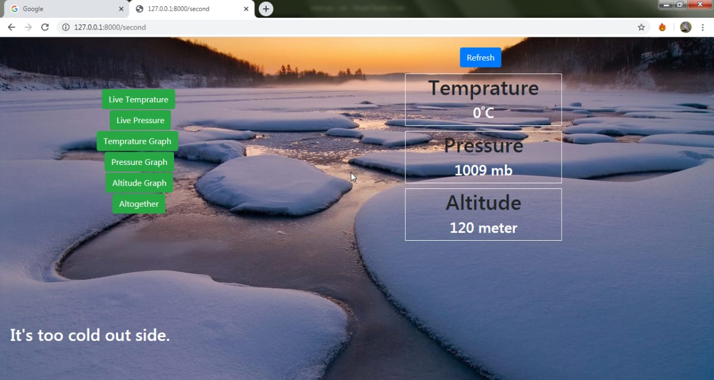
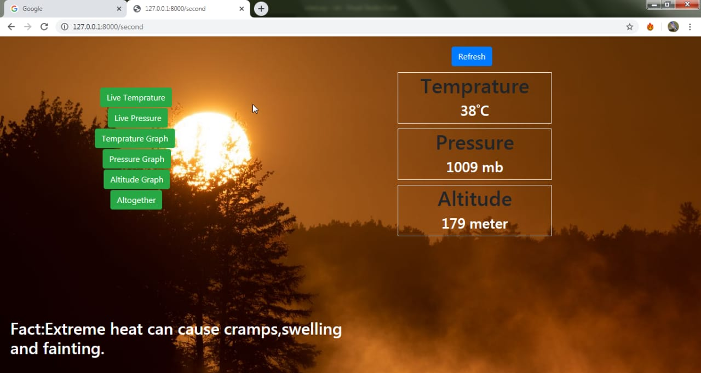
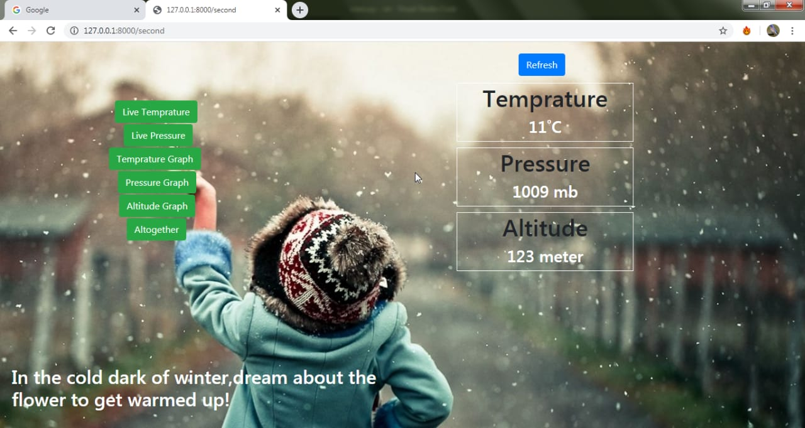
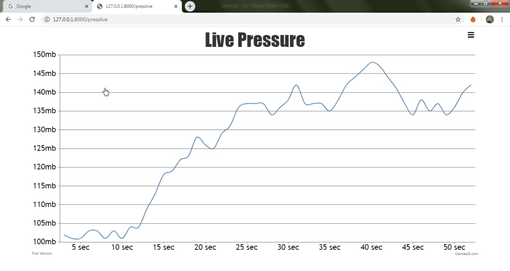
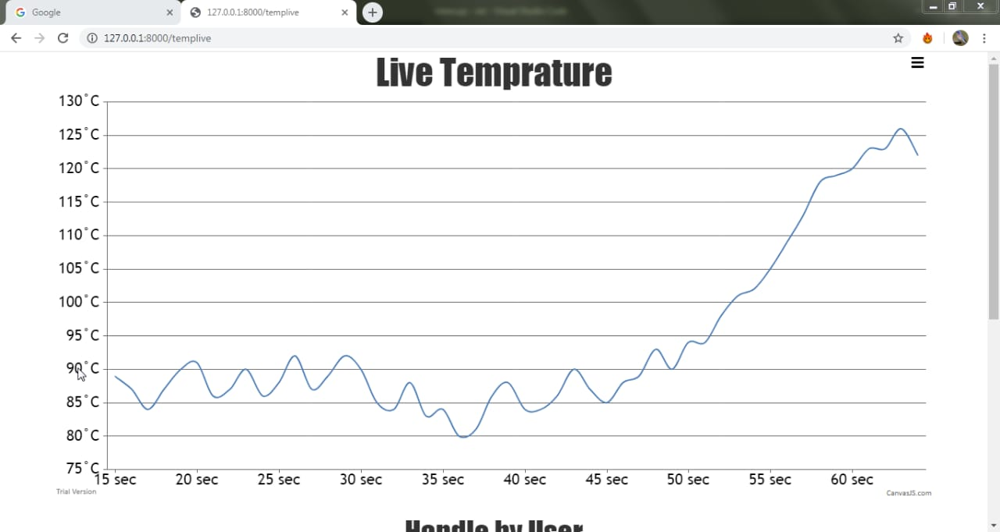

# Iot-based-weather-monitoring-system
## This is our college final project in which my contribution is to create a web interface through which any one can see the live data of temperature and altitude with the graph also.

